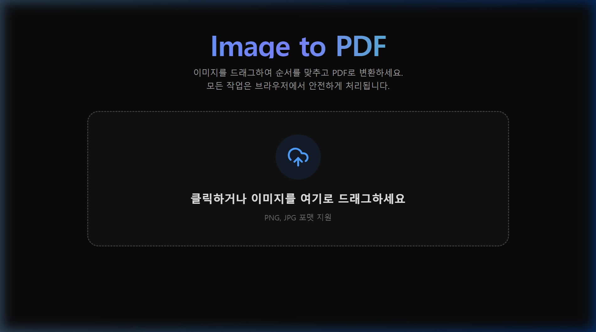

# Image to PDF (Client-Side Web Application)

이 프로젝트는 사용자가 여러 이미지를 드래그 앤 드롭으로 업로드하고 순서를 변경하여 하나의 PDF 파일로 병합할 수 있는 SvelteKit 기반 웹 애플리케이션입니다. 모든 변환 작업이 서버 전송 없이 **사용자의 브라우저 내에서 안전하게(Client-side)** 처리됩니다.

## 📸 실행 화면



## 🚀 주요 기능

- **빠르고 안전한 로컬 변환**: 업로드된 이미지는 서버에 전송되지 않으며 프라이버시가 완벽히 보장됩니다.
- **모바일 완벽 지원 (Drag & Drop)**: 데스크톱뿐만 아니라 모바일 브라우저 환경에서도 부드럽고 자연스러운 터치 기반 순서 변경을 지원합니다.
- **세련된 UI/UX**: Tailwind CSS v4를 활용하여 쾌적하고 부드러운 애니메이션을 제공합니다.
- **클라이언트 리소스 최적화**: `pdf-lib` 라이브러리를 활용해 브라우저 성능을 최대로 끌어올려 PDF를 즉시 생성합니다.
- **이미지 팝업 미리보기**: 업로드된 이미지 썸네일을 클릭하여 큰 화면으로 미리볼 수 있는 라이트박스 팝업 기능을 제공합니다.

## 🛠 기술 스택

- **Framework**: [SvelteKit](https://kit.svelte.dev/) (Svelte 5 룬 문법 적용)
- **Styling**: [Tailwind CSS v4](https://tailwindcss.com/)
- **Drag & Drop**: [svelte-dnd-action](https://github.com/isaacHagoel/svelte-dnd-action)
- **PDF Generation**: [pdf-lib](https://pdf-lib.js.org/)
- **Icons**: [lucide-svelte](https://lucide.dev/)

## 💻 로컬 개발 환경 구성

### 요구 사항
- Node.js 최신 안정 버전 (v18 이상 권장)

### 설치 및 실행

1. 의존성 패키지 설치
   ```bash
   npm install
   ```

2. 로컬 개발 서버 실행
   ```bash
   npm run dev
   ```

3. 빌드 (Production)
   ```bash
   npm run build
   ```

## 🏗 작업 내용 요약
- `sv create`를 이용한 Svelte 5 + Tailwind CSS v4 기반 프로젝트 초기 설정.
- 파일 선택, 브라우저 로컬 데이터(DragEvent/FormData)를 통한 Blob 기반 썸네일 노출 로직 구현.
- `svelte-dnd-action`을 활용한 모바일 터치 이벤트 최적화 및 썸네일 순서 조정 기능 완료.
- `pdf-lib`를 통해 브라우저 단에서 Image Buffer를 로드하여 PDF Document로 변환 후 사용자에게 Download 링크 제공.
- 클릭 시 원본 이미지 확대 미리보기(Popup/Lightbox) 기능 추가.
- Svelte 5 룬 및 표준 이벤트 핸들러(onclick 등)를 이용한 코드 안정성 및 빌드 에러 해결.
- GitHub Pages 자동 배포 환경 구성 (`adapter-static` 및 GitHub Actions 워크플로우 설정).
